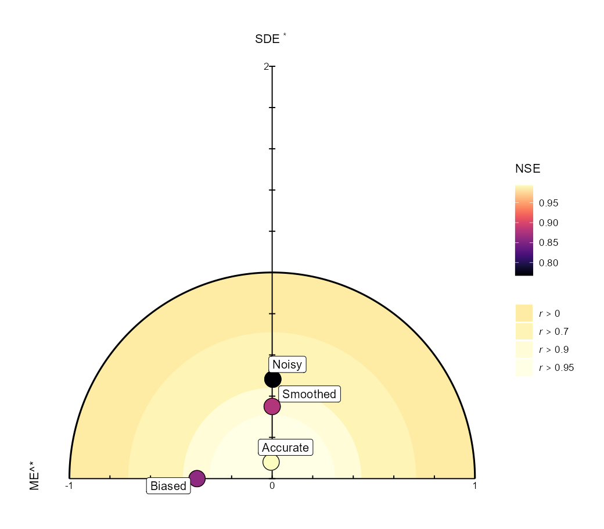
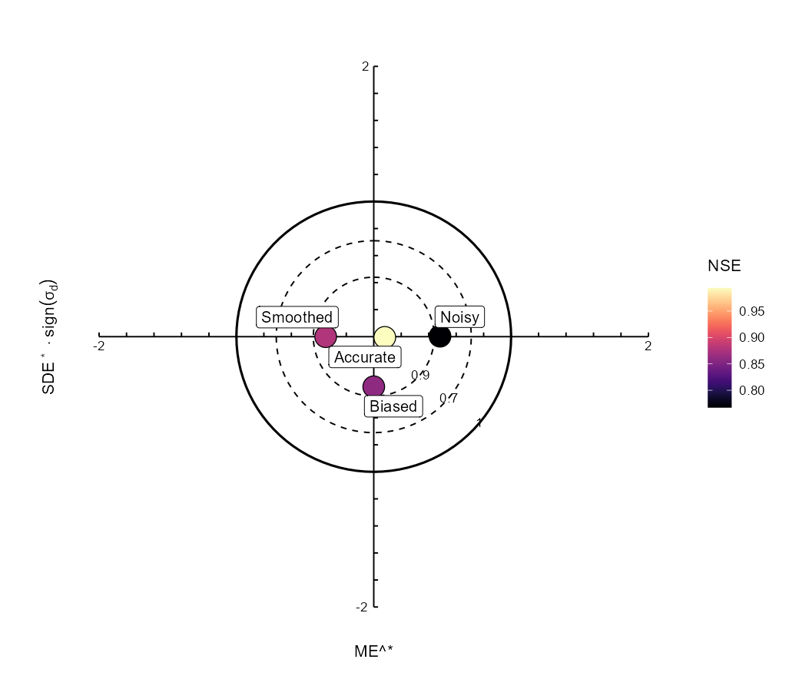
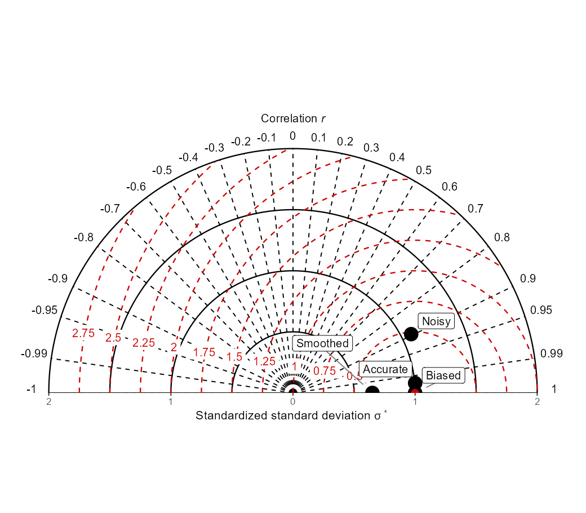

# `modelskill`: Assessing and Visualising the Performance of Continuous Prediction Models

[](https://github.com/AlexandreWadoux/modelskill/actions/workflows/R-CMD-check.yaml)
[](https://github.com/AlexandreWadoux/modelskill/actions/workflows/pkgdown.yaml)
[](LICENSE.md)

## About

`modelskill` is an R package for the **evaluation of continuous predictions and their quantified uncertainty**.

It can be used with predictions from machine-learning, statistical, geostatistical, physical, and process-based models. The package evaluates the predictions themselves rather than the algorithm that produced them.

`modelskill` brings together three complementary components:

- **prediction performance metrics**, from RMSE and bias to correlation, agreement, and model efficiency;
- **predictive-uncertainty diagnostics**, for prediction intervals, quantiles, and full predictive distributions;
- **summary diagrams and diagnostic plots**, including solar, target, Taylor, coverage, PIT, and quantile-calibration plots.

All plotting functions return standard `ggplot2` objects and can therefore be customised with the usual `ggplot2` syntax.

---

## Documentation

Three tutorials cover the main functionality of the package:

1. **[Prediction performance metrics](https://alexandrewadoux.github.io/modelskill/articles/performance-metrics.html)**  
   Evaluate bias, error magnitude, association, agreement, efficiency, relative error, and specialised prediction losses.

2. **[Predictive-uncertainty evaluation](https://alexandrewadoux.github.io/modelskill/articles/predictive-uncertainty.html)**  
   Validate prediction intervals, predictive standard deviations, quantiles, predictive samples, and full predictive distributions.

3. **[Summary diagrams and diagnostic plots](https://alexandrewadoux.github.io/modelskill/articles/summary-diagrams.html)**  
   Compare models visually with solar, target, and Taylor diagrams and learn how to customise them with `ggplot2`.

Full function documentation is available on the **[modelskill website](https://alexandrewadoux.github.io/modelskill/)**.

---

## Main functionality

| Task | Main functions |
|:--|:--|
| **Prediction performance** | [`model_metrics()`](https://alexandrewadoux.github.io/modelskill/reference/model_metrics.html), [`rmse()`](https://alexandrewadoux.github.io/modelskill/reference/rmse.html), [`mae()`](https://alexandrewadoux.github.io/modelskill/reference/mae.html), [`bias()`](https://alexandrewadoux.github.io/modelskill/reference/bias.html), [`correlation()`](https://alexandrewadoux.github.io/modelskill/reference/correlation.html), [`r2()`](https://alexandrewadoux.github.io/modelskill/reference/r2.html), [`R2()`](https://alexandrewadoux.github.io/modelskill/reference/efficiency_r2.html), [`ccc()`](https://alexandrewadoux.github.io/modelskill/reference/ccc.html), [`kge()`](https://alexandrewadoux.github.io/modelskill/reference/kge.html) |
| **Predictive uncertainty** | [`uncertainty_metrics()`](https://alexandrewadoux.github.io/modelskill/reference/uncertainty_metrics.html), [`picp()`](https://alexandrewadoux.github.io/modelskill/reference/picp.html), [`interval_width()`](https://alexandrewadoux.github.io/modelskill/reference/interval_width.html), [`interval_score()`](https://alexandrewadoux.github.io/modelskill/reference/interval_score.html), [`qcp()`](https://alexandrewadoux.github.io/modelskill/reference/qcp.html), [`pit()`](https://alexandrewadoux.github.io/modelskill/reference/pit.html), [`crps()`](https://alexandrewadoux.github.io/modelskill/reference/crps.html) |
| **Summary diagrams** | [`gg_solar()`](https://alexandrewadoux.github.io/modelskill/reference/gg_solar.html), [`gg_target()`](https://alexandrewadoux.github.io/modelskill/reference/gg_target.html), [`gg_taylor()`](https://alexandrewadoux.github.io/modelskill/reference/gg_taylor.html) |
| **Uncertainty diagnostics** | [`gg_coverage()`](https://alexandrewadoux.github.io/modelskill/reference/gg_coverage.html), [`gg_qcp()`](https://alexandrewadoux.github.io/modelskill/reference/gg_qcp.html), [`gg_pit()`](https://alexandrewadoux.github.io/modelskill/reference/gg_pit.html) |

---

## Installation

Install the development version from GitHub:

```r
install.packages("remotes")
remotes::install_github("AlexandreWadoux/modelskill")
```

Then load the package:

```r
library(modelskill)
```

> **Development status:** `modelskill` is under active development and has not yet been submitted to CRAN.

---

## Quick start

Suppose several models have predicted the same observations:

```r
library(modelskill)

set.seed(123)

obs <- seq(0, 10, length.out = 100) +
  rnorm(100, sd = 1)

models <- list(
  Good = obs + rnorm(100, sd = 0.5),
  Biased = obs + 1,
  Noisy = obs + rnorm(100, sd = 2)
)
```

### Evaluate prediction performance

Evaluate all models simultaneously:

```r
model_metrics(models, obs, digits = 3)
```

Or calculate individual statistics:

```r
rmse(obs, models$Good)

bias(obs, models$Biased)

correlation(obs, models$Good)

R2(obs, models$Good)
```

A central principle of `modelskill` is that different metrics describe different aspects of prediction performance.

For example, lowercase `r2()` is squared Pearson correlation, whereas uppercase `R2()` is the model-efficiency coefficient:

```r
r2(obs, models$Biased)

R2(obs, models$Biased)
```

A systematically biased prediction can have `r2 = 1` while having imperfect model efficiency.

See the **[prediction-performance tutorial](https://alexandrewadoux.github.io/modelskill/articles/performance-metrics.html)** for interpretation of the available metrics.

---

## Summary diagrams

`modelskill` provides solar, target, and Taylor diagrams for comparing several aspects of model performance simultaneously.

```r
gg_solar(models, obs, label = TRUE)

gg_target(models, obs, label = TRUE)

gg_taylor(models, obs, label = TRUE)
```

### Graphical model evaluation

<p align="center">
  
  
  
</p>

The three diagrams provide complementary information:

- the **solar diagram** combines mean error, centred error, total error, and additional performance information;
- the **target diagram** additionally distinguishes whether predictions have less or more variability than the observations;
- the **Taylor diagram** focuses on correlation, relative variability, and centred error.

The Taylor diagram can also be displayed using only positive correlations:

```r
gg_taylor(
  models,
  obs,
  legend = TRUE,
  half = TRUE
)
```

See the **[summary-diagram tutorial](https://alexandrewadoux.github.io/modelskill/articles/summary-diagrams.html)** for interpretation and additional options.

---

## Evaluating predictive uncertainty

`modelskill` evaluates quantified predictive uncertainty represented as:

- prediction intervals;
- predictive means and standard deviations;
- predicted quantiles;
- predictive samples or ensemble members;
- full predictive distributions.

### Prediction intervals

For example, evaluate a 95% prediction interval:

```r
pred <- models$Good
predictive_sd <- rep(1, length(obs))

lower95 <- pred + qnorm(0.025) * predictive_sd
upper95 <- pred + qnorm(0.975) * predictive_sd

uncertainty_metrics(
  obs,
  lower = lower95,
  upper = upper95,
  level = 0.95
)
```

The output includes prediction interval coverage, coverage error, interval width, and interval score.

### Predictive mean and standard deviation

A normal predictive distribution specified by its mean and standard deviation can be evaluated directly with CRPS:

```r
crps(
  obs,
  pred = pred,
  predictive_sd = predictive_sd
)
```

Calibration across several interval levels can be visualised with:

```r
gg_coverage(
  obs,
  pred = pred,
  predictive_sd = predictive_sd
)
```

### Predictive samples

When complete predictive samples are available, retain the full distributions:

```r
set.seed(456)

predictive_samples <- sapply(
  seq_len(200),
  function(i) {
    rnorm(
      length(obs),
      mean = pred,
      sd = predictive_sd
    )
  }
)

crps(
  obs,
  distribution = predictive_samples
)
```

See the **[predictive-uncertainty tutorial](https://alexandrewadoux.github.io/modelskill/articles/predictive-uncertainty.html)** for prediction intervals, QCP, PIT, CRPS, predictive samples, and scoring rules.

---

## Customising plots

All plotting functions return ordinary `ggplot2` objects.

For example:

```r
gg_solar(
  models,
  obs,
  colour_by = "model"
) +
  ggplot2::labs(
    title = "Model comparison"
  ) +
  ggplot2::theme(
    legend.position = "bottom"
  )
```

The same principle applies to solar, target, Taylor, coverage, PIT, and QCP plots.

---

## Scientific basis

The solar and Taylor diagram implementations build on:

> Wadoux, A. M. J.-C., Walvoort, D. J. J. & Brus, D. J. (2022).  
> An integrated approach for the evaluation of quantitative soil maps through Taylor and solar diagrams.  
> *Geoderma*, **405**, 115332.  
> <https://doi.org/10.1016/j.geoderma.2021.115332>

The Taylor diagram was originally introduced by:

> Taylor, K. E. (2001).  
> Summarizing multiple aspects of model performance in a single diagram.  
> *Journal of Geophysical Research: Atmospheres*, **106**, 7183–7192.  
> <https://doi.org/10.1029/2000JD900719>

The target diagram follows:

> Jolliff, J. K., Kindle, J. C., Shulman, I., Penta, B., Friedrichs, M. A. M., Helber, R. & Arnone, R. A. (2009).  
> Summary diagrams for coupled hydrodynamic-ecosystem model skill assessment.  
> *Journal of Marine Systems*, **76**, 64–82.  
> <https://doi.org/10.1016/j.jmarsys.2008.05.014>

Predictive-uncertainty validation is informed by:

> Schmidinger, J. & Heuvelink, G. B. M. (2023).  
> Validation of uncertainty predictions in digital soil mapping.  
> *Geoderma*, **437**, 116585.  
> <https://doi.org/10.1016/j.geoderma.2023.116585>

---

## Getting help

Function documentation is available directly in R:

```r
?model_metrics
?uncertainty_metrics
?gg_solar
?gg_target
?gg_taylor
```

Bug reports and feature requests can be submitted through the
[GitHub issue tracker](https://github.com/AlexandreWadoux/modelskill/issues).

---

## Author and licence

**Alexandre M.J.-C. Wadoux**  
Author, maintainer, and copyright holder

`modelskill` is released under the [MIT License](LICENSE.md).
